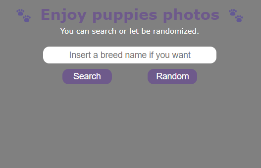

# API Dog

On that project I did an API interaction to randomize images of dogs ou search random images by it breeds.

## Preview Layout

### See in Action

> If you want to see how it works, I recommend to [fork](https://docs.github.com/en/get-started/quickstart/fork-a-repo) this repo and opening it in an IDE, a Source-code editor or in a Browser.

## Technologies

## Author

Hugo - Djbetamax - 8dev
